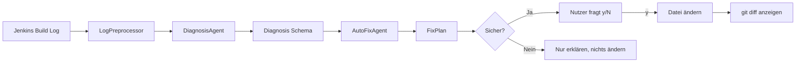

# Sprint 3 Präsentation — Pipeline Doctor

**Termin:** 26.06.2026  
**Thema:** Automatischer Fix nach Bestätigung

---

## Folie 1 — Titel

# Pipeline Doctor
## Sprint 3: Vom Diagnose-Agenten zum Auto-Fix-Agenten

**Projekt:** Agentic AI Modul  
**Ziel:** Fehlgeschlagene Jenkins-Builds automatisch analysieren und sichere Fixes nach Bestätigung anwenden.

**Sagen:**
> In Sprint 1 habe ich Jenkins-Logs automatisch geholt. In Sprint 2 wurden diese Logs per LLM diagnostiziert. In Sprint 3 geht der Pipeline Doctor einen Schritt weiter: Er schlägt nicht nur einen Fix vor, sondern kann einen sicheren Fix nach meiner Bestätigung automatisch anwenden.

---

## Folie 2 — Ausgangslage nach Sprint 2

## Was vorher schon funktioniert hat

- Jenkins läuft lokal mit drei absichtlich fehlschlagenden Jobs
- Build-Logs werden automatisch abgerufen
- Logs werden vorverarbeitet, damit nur relevante Zeilen ans LLM gehen
- GWDG/KISSKI LLM erstellt eine strukturierte Diagnose
- Ergebnis enthält:
  - Fehlertyp
  - Root Cause
  - betroffene Datei
  - Fix-Vorschlag
  - Konfidenz

**Sagen:**
> Sprint 2 hat den eigentlichen Diagnose-Teil geliefert. Das System konnte sagen: Das ist ein Syntaxfehler, Dependency-Fehler oder Testfehler. Aber es hat noch nichts selbst geändert.

---

## Folie 3 — Ziel von Sprint 3

## Neue Funktion

Der Pipeline Doctor soll:

1. Fehlerlog finden
2. Log mit LLM analysieren
3. aus der Diagnose einen konkreten `FixPlan` erzeugen
4. entscheiden, ob der Fix sicher automatisierbar ist
5. den Nutzer fragen: **Möchtest du diesen Fix anwenden? [y/N]**
6. erst nach Bestätigung die Datei ändern
7. danach `git diff` anzeigen

**Sagen:**
> Der wichtigste Punkt ist Sicherheit: Der Agent darf nicht einfach Code ändern. Er erklärt erst, was er tun will, und wartet auf meine Bestätigung.

---

## Folie 4 — Architektur



**Sagen:**
> Ich habe die Architektur bewusst modular gehalten. Der DiagnosisAgent bleibt für die Analyse zuständig. Der neue AutoFixAgent übernimmt nur den Schritt von Diagnose zu konkretem FixPlan und Anwendung.

---

## Folie 5 — Neue Komponenten

## Implementiert in Sprint 3

- `pipeline_doctor/agent/fix_plan_schema.py`
  - Pydantic-Modell für konkrete Fix-Pläne

- `pipeline_doctor/agent/auto_fix_agent.py`
  - plant Fixes
  - prüft Sicherheit
  - fragt nach Bestätigung
  - wendet sichere Fixes an

- `scripts/apply_suggested_fix.py`
  - CLI für die Demo
  - unterstützt `--job <name>` und `--all`

- `tests/test_auto_fix_agent.py`
  - Tests ohne echten Jenkins und ohne GitHub

**Sagen:**
> Der neue Kern ist der AutoFixAgent. Er trennt bewusst zwischen Diagnose, Planung und tatsächlicher Änderung.

---

## Folie 6 — Was automatisch gefixt wird

## Sicherer Auto-Fix: Syntaxfehler

Beispiel im Test-Repo:

```python
def multiply(x, y)
    return x * y
```

Der Agent erkennt:

```python
def multiply(x, y):
    return x * y
```

Warum sicher?

- klarer Syntaxfehler
- kleine lokale Änderung
- deterministisch prüfbar
- Änderung wird vorher angezeigt
- Anwendung nur nach `y`

**Sagen:**
> Für die Demo automatisiere ich bewusst nur einen sicheren Fall: einen fehlenden Doppelpunkt in einer Funktionsdefinition. Das ist klein, nachvollziehbar und gut demonstrierbar.

---

## Folie 7 — Was bewusst NICHT automatisch gefixt wird

## Sicherheitsgrenzen

Nicht automatisch angewendet:

- `dependency_not_found`
  - Paket könnte falsch geschrieben sein
  - Paket könnte ersetzt werden müssen
  - blindes Löschen wäre riskant

- `test_failure`
  - unklar, ob Test falsch ist oder Code falsch ist
  - fachliche Entscheidung nötig

**Sagen:**
> Das ist ein wichtiger Teil des Agentic-AI-Themas: Ein Agent muss nicht alles automatisch machen. Gute Automatisierung heißt auch, gefährliche Fälle zu erkennen und bewusst zu stoppen.

---

## Folie 8 — Live-Demo: Vorbereitung

## Terminal vorbereiten

```powershell
cd "C:\Users\aldali\Documents\Agentic ai\pipeline-doctor"
.venv\Scripts\Activate.ps1
```

Falls der Syntax-Fix schon angewendet wurde, Demo-Zustand zurücksetzen:

```powershell
cd test-repos\failing-syntax
git checkout main.py
cd ..\..
```

**Sagen:**
> Für Sprint 3 brauche ich Jenkins nicht zwingend live, weil die Logs bereits lokal in `logs/` vorhanden sind. Das macht die Demo stabiler.

---

## Folie 9 — Live-Demo: Alle Fehler analysieren

## Ein Befehl für alle Jobs

```powershell
python scripts/apply_suggested_fix.py --all
```

Erwartung:

1. `failing-syntax`
   - Diagnose: SyntaxError
   - FixPlan wird angezeigt
   - Frage: `Möchtest du diesen Fix anwenden? [y/N]`
   - bei `y`: Doppelpunkt wird eingefügt
   - `git diff` wird angezeigt

2. `failing-dependency`
   - Diagnose wird gezeigt
   - Fix wird aus Sicherheitsgründen nicht angewendet

3. `failing-tests`
   - Diagnose wird gezeigt
   - Fix wird aus Sicherheitsgründen nicht angewendet

**Sagen:**
> Mit `--all` läuft der Agent über alle drei bekannten Jenkins-Jobs. Das zeigt gleichzeitig: Er kann einen Fall fixen, aber auch zwei Fälle bewusst ablehnen.

---

## Folie 10 — Erwarteter Output

## Beispielausgabe

```text
Pipeline Doctor — Sprint 3: Auto-Fix
Jobs: failing-syntax, failing-dependency, failing-tests

Job: failing-syntax
Log: failing-syntax-build-2.log
Analysiere Log mit LLM ...
Diagnose: SyntaxError

DIAGNOSE & FIX-PLAN
Fehlertyp       : syntax_error
Betroffene Datei: main.py
Sicherheit      : Sicher nach Bestätigung

Möchtest du diesen Fix anwenden? [y/N] y
1 Zeile(n) in main.py korrigiert.

git diff
- def multiply(x, y)
+ def multiply(x, y):
```

**Sagen:**
> Der sichtbare `git diff` ist wichtig: Ich kann direkt nachvollziehen, was der Agent geändert hat.

---

## Folie 11 — Tests und Qualität

## Absicherung

Getestet wird:

- `FixPlan`-Schema
- Syntax-Fix wird korrekt geplant
- Fix wird nur bei Bestätigung angewendet
- bei `n` oder Enter wird nichts geändert
- Dependency-Fehler werden nicht automatisch angewendet
- Testfehler werden nicht automatisch angewendet
- kein echter Jenkins in Unit-Tests nötig

Test-Befehl:

```powershell
pytest tests/test_auto_fix_agent.py -v
```

**Sagen:**
> Die Tests prüfen vor allem die Sicherheitslogik. Der Agent darf nur ändern, wenn `safe_to_apply=True` ist und ich aktiv bestätige.

---

## Folie 12 — Ergebnis von Sprint 3

## Sprint 3 abgeschlossen

Erreicht:

- Diagnose → FixPlan → Bestätigung → Änderung
- sicherer Auto-Fix für Syntaxfehler
- bewusste Blockierung riskanter Fixes
- CLI mit Einzeljob oder `--all`
- lokale Änderung im Test-Repo
- sichtbarer `git diff`
- Tests für AutoFixAgent

**Sagen:**
> Sprint 3 macht Pipeline Doctor zu einem echten Agenten-Workflow: beobachten, analysieren, planen, nachfragen und handeln.

---

## Folie 13 — Was ich gelernt habe

## Erkenntnisse

- LLM-Ausgaben müssen normalisiert werden
  - Beispiel: `SyntaxError` statt `syntax_error`
- Nicht jeder Fix ist sicher automatisierbar
- Bestätigung ist ein wichtiger Sicherheitsmechanismus
- Lokale Logs machen Demos stabiler als Live-Jenkins
- Kleine deterministische Fixes sind ideal für Auto-Fix-Demos

**Sagen:**
> Ein praktisches Problem war, dass das LLM manchmal andere Begriffe zurückgibt als erwartet. Deshalb normalisiert der Agent Fehlertypen, bevor er entscheidet, welcher Fix möglich ist.

---

## Folie 14 — Nächste Schritte

## Ausblick

Mögliche Erweiterungen:

- nach Fix automatisch Tests erneut ausführen
- Branch automatisch erstellen
- Commit vorbereiten
- Pull Request nach expliziter Bestätigung öffnen
- weitere Syntax-Fixes unterstützen
- GitHub-Integration mit PyGithub ausbauen
- Fehler-Memory für wiederkehrende Probleme

**Sagen:**
> Der nächste logische Schritt wäre: Nach dem Fix automatisch den Jenkins-Job oder lokale Tests erneut ausführen und später einen Pull Request vorbereiten.

---

## Folie 15 — Abschluss

# Pipeline Doctor Sprint 3

## Von der Diagnose zur kontrollierten Aktion

**Kernbotschaft:**

> Der Agent darf handeln, aber nur kontrolliert: Diagnose anzeigen, Fix planen, Risiko bewerten, Bestätigung einholen, Änderung transparent machen.

**Demo-Befehl:**

```powershell
python scripts/apply_suggested_fix.py --all
```
